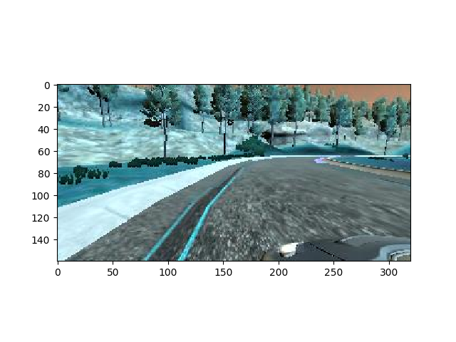
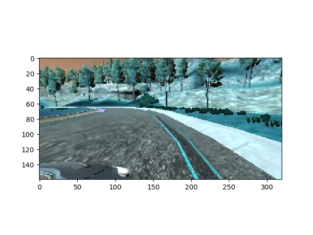

# **Behavioral Cloning** 

## Writeup Template

### You can use this file as a template for your writeup if you want to submit it as a markdown file, but feel free to use some other method and submit a pdf if you prefer.

---

**Behavioral Cloning Project**

The goals / steps of this project are the following:
* Use the simulator to collect data of good driving behavior
* Build, a convolution neural network in Keras that predicts steering angles from images
* Train and validate the model with a training and validation set
* Test that the model successfully drives around track one without leaving the road
* Summarize the results with a written report

## Rubric Points
### Here I will consider the [rubric points](https://review.udacity.com/#!/rubrics/432/view) individually and describe how I addressed each point in my implementation.  
#### Are all required files submitted?
Yes.

#### Is the code functional?
Yes. You can verify it by running:
```
python drive.py model.h5
```

#### Is the code usable and readable?
I'd argue that yes. Although there are some bits that can definitely be improved.

#### Has an appropriate model architecture been employed for the task?
Yes, as we are going to explain later in this document, we based our model architecture on the NVIDIA self-driving model architecture.

#### Has an attempt been made to reduce overfitting of the model?
Yes. We are going to get into more details about this later.

#### Have the model parameters been tuned appropriately?
Yes. We are going to get into more details about this later.

#### Has the training data chosen appropriately?
Yes. We are going to get into more details about this later.

#### Is the solution design documented?
Yes. The documentation is split between this document and the code itself.

#### Is the model architecture documented?
Yes. We are going to get into more details about this later.

#### Is the creation of the training dataset and training process documented?
Yes. We are going to get into more details about this later.

#### Is the car able to navigate correctly on test data?
Yes. As you can see in the [following video](video.mp4)

---
### Files Submitted & Code Quality

#### 1. Submission includes all required files and can be used to run the simulator in autonomous mode

My project includes the following files:
* model.py containing the script to create and train the model
* drive.py for driving the car in autonomous mode
* model.h5 containing a trained convolution neural network 
* writeup/template.md for summarizing the results

#### 2. Submission includes functional code
Using the Udacity provided simulator and my drive.py file, the car can be driven autonomously around the track by executing 
```sh
python drive.py model.h5
```

#### 3. Submission code is usable and readable

The model.py file contains the code for training and saving the convolution neural network. The file shows the pipeline I used for training and validating the model, and it contains comments to explain how the code works.

### Model Architecture and Training Strategy

#### 1. An appropriate model architecture has been employed

The model architecture that I used is based on the NVIDIA [End to End Learning for Self-Driving Cars paper](nvidia-paper.pdf).

* First of all, we apply a normalization layer on the given images to transform the [0, 255] color space into the [-0.5, 0.5] range.
* We then apply a cropping layer to get rid of unnecessary pixels at the bottom and top portions of the image.
* 5x5 Convolutional layer with 2x2 strides and 24 output features followed by a RELU activation layer.
* 5x5 Convolutional layer with 2x2 strides and 36 output features followed by a RELU activation layer.
* 5x5 Convolutional layer with 2x2 strides and 48 output features followed by a RELU activation layer.
* 3x3 Convolutional layer with 64 output features followed by a RELU activation layer.
* 3x3 Convolutional layer with 64 output features followed by a RELU activation layer.
* Flattening layer.
* Dense layer with 1164 features followed by a RELU activation layer.
* Dense layer with 100 features followed by a RELU activation layer.
* Dense layer with 50 features followed by a RELU activation layer.
* Dense layer with 10 features followed by a RELU activation layer.
* And finally another dense layer with one output feature.

This can be verified by running the [model.py](../model.py) script with the --summary option:
```
_________________________________________________________________
Layer (type)                 Output Shape              Param #           
=================================================================                                                                                                                
lambda_1 (Lambda)            (None, 160, 320, 3)       0         
_________________________________________________________________
cropping2d_1 (Cropping2D)    (None, 65, 320, 3)        0         
_________________________________________________________________       
conv2d_1 (Conv2D)            (None, 31, 158, 24)       1824                                                                                                                      
_________________________________________________________________      
conv2d_2 (Conv2D)            (None, 14, 77, 36)        21636     
_________________________________________________________________
conv2d_3 (Conv2D)            (None, 5, 37, 48)         43248                                                                                                                     
_________________________________________________________________
conv2d_4 (Conv2D)            (None, 3, 35, 64)         27712
_________________________________________________________________
conv2d_5 (Conv2D)            (None, 1, 33, 64)         36928
_________________________________________________________________
flatten_1 (Flatten)          (None, 2112)              0
_________________________________________________________________
dense_1 (Dense)              (None, 1164)              2459532
_________________________________________________________________
dense_2 (Dense)              (None, 100)               116500
_________________________________________________________________
dense_3 (Dense)              (None, 50)                5050
_________________________________________________________________
dense_4 (Dense)              (None, 10)                510
_________________________________________________________________
dense_5 (Dense)              (None, 1)                 11
=================================================================
Total params: 2,712,951
Trainable params: 2,712,951
Non-trainable params: 0
_________________________________________________________________
```

#### 2. Attempts to reduce overfitting in the model

Dropout was considered in order to reduce overfitting, but wasn't actually necessary for the easy track.

One measure implemented to avoid overfitting was to do a manual inspection on the verification loss and try to tune the number of epochs that will result in the "best" verification loss (for example, if we see that the verification loss decreases after N epochs, but starts oscillating afterwards, then let's reduce the number of epochs to N).

Another measure that was implemented was to split the train data into a train data and validation data (80% and 20% respectively).

#### 3. Model parameter tuning

The model used an adam optimizer, so the learning rate was not tuned manually (model.py line 134). The only parameters we tuned were the batch_size (which was set to 600 after some experimentation) and the correction factor for images that correspond to the left and right cameras (which was set to 0.2).

#### 4. Appropriate training data

Training data was chosen to keep the vehicle driving on the road. I used a combination of center lane driving, recovering from the left and right sides of the road. Additionally, I augmented the data set by mirroring images. For example, if the car is turning left in a certain image and has a steering measurement of X, then we could flip the image in order to get another image of the car turning right with a steering measurement of -X.

Additionally, some extra data was collected by running the simulator in training mode. The extra data came from both tracks. However, the extra data wasn't necessary for the easy track, as the data that was present in the data folder was more than enough to get the car drive successfully around the track.

### Model Architecture and Training Strategy

#### 1. Solution Design Approach

The overall strategy in order to derive a working solution was to start small, do baby steps and measure their impact on the model accuracy.

The first step was a simple architecture with one fully connected layer that outputs the predicted steering measurement. That dummy model was useful to test everything out (including the autonomous mode of the provided simulation application).

The second step was to use a more complicated model architecture. I implemented a variation of Lenet5, but with a extra fully connected layer right after the last convolution. With that model we were able to pass the first curve and approach the bridge.

The third step was to get a more suitable model architecture for this domain. So we switched to the NVIDIA proposed architecture for self-driving cars described before. That model was good enough to drive pass the bridge, but it will fail at some curves. The problem is that I wasn't training the model for the right number of epochs, so the model was underfitting the data. After finding the sweet spot for the number of epochs, the model was able to driving around the track without any problems whatsoever.

The last step was to tackle the hard track. For this one I decided to gather more data, and train the model for a bit longer. The model was able to drive around some curves, but was definitely failing around sharp curves (around +/- 20 degrees). I didn't spend too much time on it, but one of the clear next steps for driving around the hard track is to get a distribution of the data we collected. If we are missing a lot of data for certain steering measurements, then we would need to either generate more data specifically in those situations or generate more synthatic data for uncommon steering measurements.

#### 2. Creation of the Training Set & Training Process

First of all, the training data was split into two sets: 80% training data and 20% validation data.

Then, In order to augment the data set, I flipped the images (from left to right) and their steering measurements. Additionally I took into consideration images from all cameras (not just the center camera). For example:

This is one of the original images of the data set:



And this is after the augmentation:



Additionally in order to capture good driving behavior, I recorded extra data. One lap in the easy track focusing on center lane driving. Another lap on the easy track but going clockwise instead of counter-clockwise. And finally, one full lap on the hard track focusing on center lane driving. But it's worth mentioning that the extra data wasn't necessary for the easy track. The model hasn't been able to drive a full lap around the hard track, but the extra data has definitely helped improving the model.

It's important to mention that the data was shuffled before being feeded into the model. The first time it's shuffled is before we start loading the memory into images. Then the data gets shuffled one more time before yielding a subset of the data. The second shuffle is needed because the generator never ends, so we are looping over the data over and over again. If we don't shuffle each batch, then it's possible that the model will start making some prediction based on the ordering of the images.

It was important the tune the number of epochs after introducing more data, otherwise we would end up with an underfitting model.
